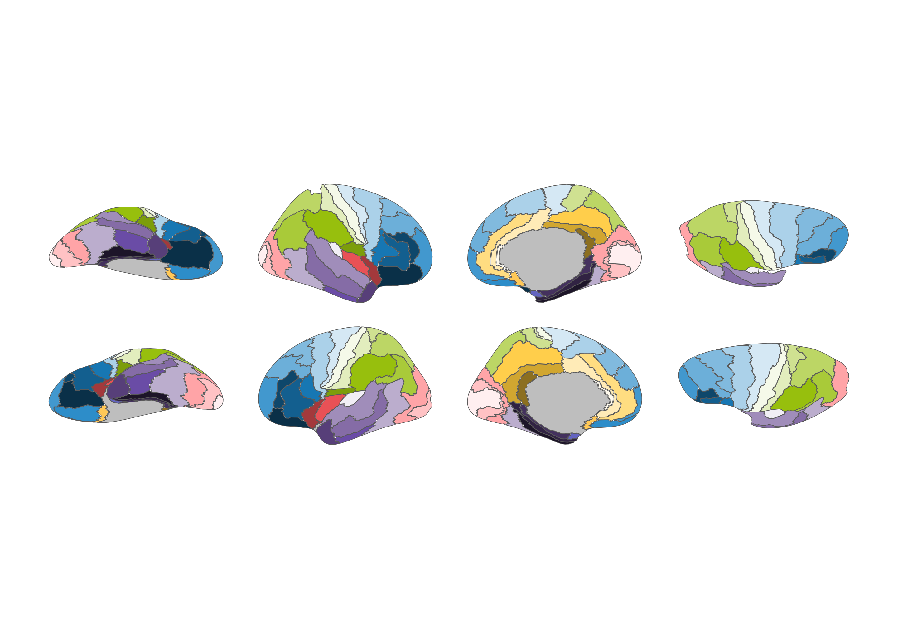

<!-- README.md is generated from README.Rmd. Please edit that file -->

# ggsegBrodmann 

<!-- badges: start -->

[](https://github.com/ggsegverse/ggsegBrodmann/actions)
[](https://zenodo.org/badge/latestdoi/424723872)

<!-- badges: end -->

This package contains dataset for plotting the
[Brodmann](https://digital.zbmed.de/zbmed/id/554966?) atlas with ggseg
and ggseg3d, based on the supplementary materials of Pijnenburg et al.,
NeuroImage, 239, 2021
[DOI](https://doi.org/10.1016/j.neuroimage.2021.118274); Version 1;
15-01-2021.

To learn how to use these atlases, please look at the documentation for
[ggseg](https://ggsegverse.github.io/ggseg/) and
[ggseg3d](https://ggsegverse.github.io/ggseg3d).

## Installation

You can install the released version of ggsegBrodmann from
[GitHub](https://github.com/) with:

``` r
# install.packages("remotes")
remotes::install_github("ggsegverse/ggsegBrodmann")
```

``` r
library(ggseg)
library(ggsegBrodmann)
library(ggplot2)

ggplot() +
  geom_brain(
    atlas = brodmann(),
    mapping = aes(fill = label),
    position = position_brain(hemi ~ view),
    show.legend = FALSE
  ) +
  scale_fill_manual(values = brodmann()$palette, na.value = "grey") +
  theme_void()
```



``` r
library(ggseg3d)

ggseg3d(atlas = brodmann()) |>
  pan_camera("right lateral")
```


Please note that the ‘ggsegBrodmann’ project is released with a
[Contributor Code of Conduct](CODE_OF_CONDUCT.md). By contributing to
this project, you agree to abide by its terms.
