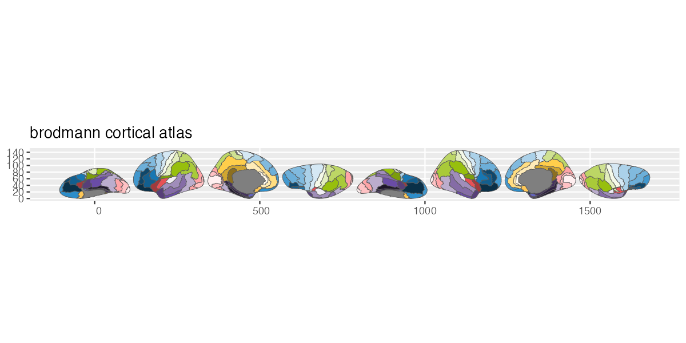

# ggsegBrodmann

Brodmann Areas Atlas for the ggsegverse Ecosystem.

## Installation

``` r
# install.packages("remotes")
remotes::install_github("ggsegverse/ggsegBrodmann")
```

## Usage

``` r
library(ggsegBrodmann)
library(ggseg)

plot(brodmann()) +
  theme_brain()
```

## Atlas

### brodmann

Brodmann areas cortical parcellation with 39 regions per hemisphere (Brodmann, 1909; Pijnenburg et al., 2021).


